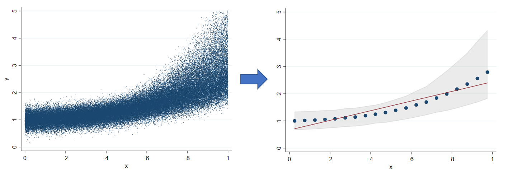
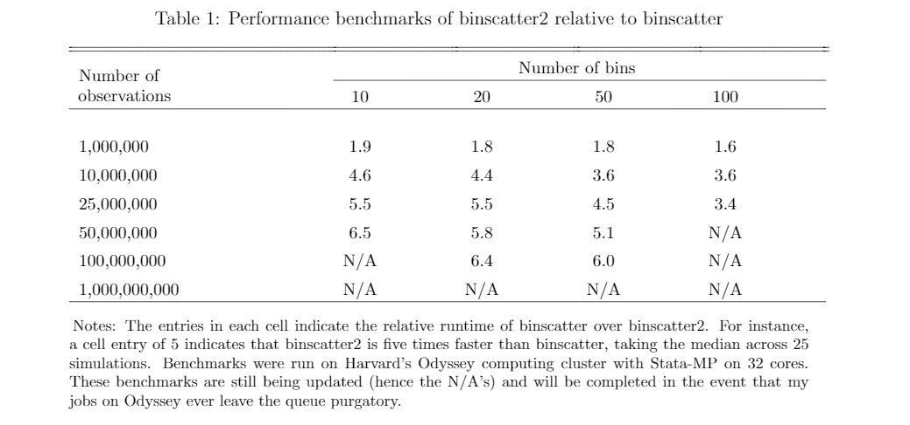

binscatter2
=================================

[Overview](#overview)
| [Motivation](#motivation)
| [Installation](#installation)
| [Usage](#usage)
| [Benchmarks](#benchmarks)
| [To-Do](#todo)
| [Acknowledgements](#acknowledgements)
| [License](#license)

Faster binned scatterplots in Stata with a few new bells and whistles

`version 0.13 13feb2019`


Overview
---------------------------------

binscatter2 is a program for producing binned scatterplots in Stata. It nests the functionality of the excellent [binscatter](https://github.com/michaelstepner/binscatter) package, but runs substantially faster for big datasets (see [benchmarks](#benchmarks)). In addition, binscatter2 offers a handful of new features: the ability to overlay additional information about the conditional probability distribution (e.g. quantile intervals) and expanded options for fit lines. saving, and multi-way fixed effects.

Motivation
---------------------------------

Binned scatterplots are a convenient, non-parametric method to visualize an arbitrary conditional expectation function. They are useful for examining the relationship between variables, possibly conditional on a set of covariates and/or fixed effects. Michael Stepner has provided a wonderful slide deck describing binned scatterplots on his website, available [here](https://michaelstepner.com/binscatter/binscatter-StataConference2014.pdf). 

Anyone who has used binscatter on a large dataset can appreciate that it takes a while to run. The original binscatter program is extremely well-written and was very efficient when it was written; however, recent improvements made possible by the Stata program [gtools](https://github.com/mcaceresb/stata-gtools) have allowed several of the operations underlying binscatter to be accomplished more efficiently and with fewer lines of code. This means that binscatter2 runs much more quickly than binscatter for large datasets, as demonstrated in the [benchmarks](#benchmarks) below. In my experience, working with data involving tens or hundreds of millions of observation, binscatter2 runs between two and eight times faster than binscatter.

In addition, binscatter2 contains a handful of additional new features intended to enhance the functionality of binscatter. For one, binscatter now allows quantile intervals to be overlaid on top of the graph. This allows the user to gauge variation in the conditional distribution of y given x.


New Features
---------------------------------

In addition to general performance improvements, binscatter2 adds a few new features to binscatter. In particular:

- [x] **Support for reghdfe**. If [reghdfe](https://github.com/sergiocorreia/reghdfe) is installed, it is automatically used (unless specified otherwise with noreghdfe option). This offers modest further speed improvements and allows the user to directly absorb multi-way fixed effects. 
- [x] **New distributional statistics**. The user can overlay quantiles of the sample distribution on top of the means/medians within each bin, providing more information on the shape of the conditional distribution of y given x.
- [x] **Flexible save commands**. The user can save scatter points out to .dta files (extension automatically detected by input of savedata() option) and also choose to omit the do-file created by savedata() with the nodofile option.
- [x] **Expanded fit line options**. Exponential and logarithmic fits now supported, with higher-order polynomials coming soon.





Installation
---------------------------------

There are two options for installing binscatter2.

1. The most recent version can be installed from Github with the following Stata command:

```stata
net install binscatter2, from(https://raw.githubusercontent.com/mdroste/stata-binscatter2/master/)
```

2. A ZIP containing the program can be downloaded and manually placed on the user's adopath from Github.

I plan on submitting a stable version of this project to the SSC repository very soon.


This project is being distributed separately from the binscatter repository for a few reasons. For one, binscatter2 requires the compiled package gtools to run, potentially making the update process nontrivial, especially for Stata users working on server environments that may not have privileges to compile code or modify available Stata packages. Second, incorporating the functionality of gtools into binscatter involves large changes to many parts of the code, and I can't guarantee that the multiple existing unresolved issues/forks on the binscatter project page can be resolved easily with the present version of binscatter2. Third, binscatter2 creates a host of new features - given this and the aforementioned large changes to the code, it may have bugs to resolve. 

Usage
---------------------------------

Complete internal documentation is provided with the installation and can be accessed by typing:
```stata
help binscatter2
````

Basic usage of binscatter2 is nearly identical to binscatter and should be familiar to any users of the original package.

This repository includes a do-file, check.do, that provides a number of checks to verify the functionality of each option within binscatter2 and demonstrates equivalence to binscatter for options shared by both programs. The file check_speed.do runs Monte Carlo simulations that were used in the benchmark section of this readme.


Benchmarks
---------------------------------




  
Todo
---------------------------------

The following items will be addressed soon:

- [ ] Finish benchmarking section of this readme
- [ ] Include a few usage pictures
- [ ] Allow for higher-order polynomial fit lines
- [ ] Arbitrary quantile dots (i.e. not just mean, median)
- [ ] Save out quantile intervals when using savedata() option
- [ ] More aesthetic options on quantiles() option


Acknowledgements
---------------------------------

As the name suggests, this program builds extensively on the indispenseable binscatter package, developed by the illustrious [Michael Stepner](https://github.com/michaelstepner) and Jessica Laird. 

In addition, binscatter2 would certainly not have been possible without [gtools](https://github.com/mcaceresb/stata-gtools) by Mauricio Caceres Bravo, which in turn would not have happened without [ftools](https://github.com/sergiocorreia/ftools), developed by Sergio Correa.


License
---------------------------------

binscatter2 is [MIT-licensed](https://github.com/mdroste/stata-binscatter2/blob/master/LICENSE).
